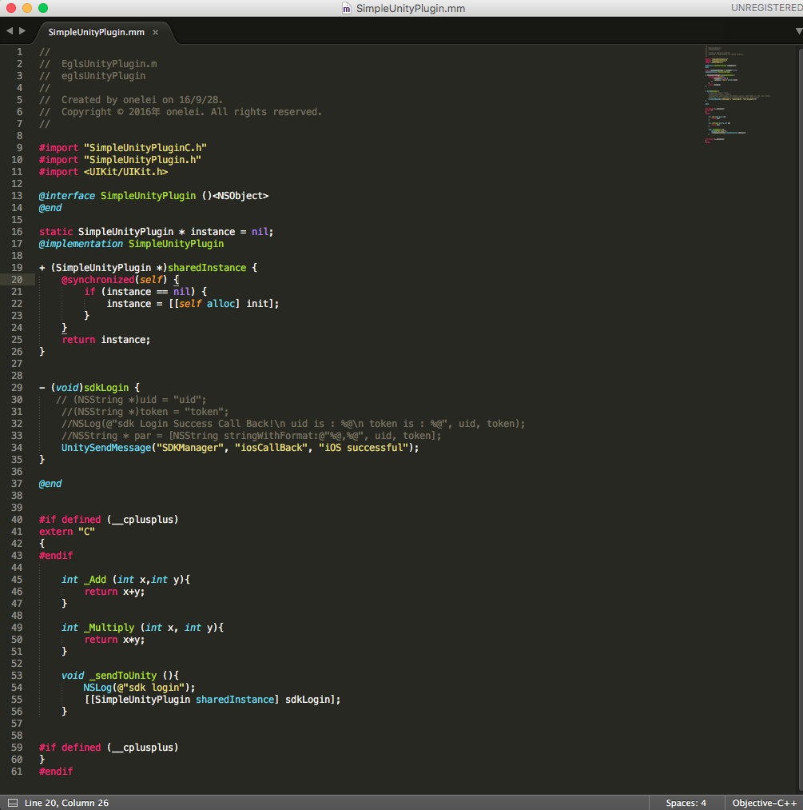
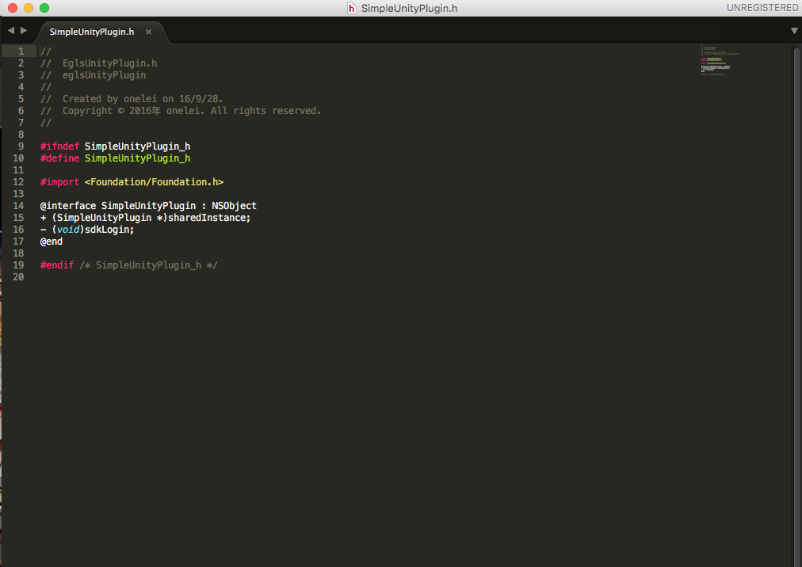
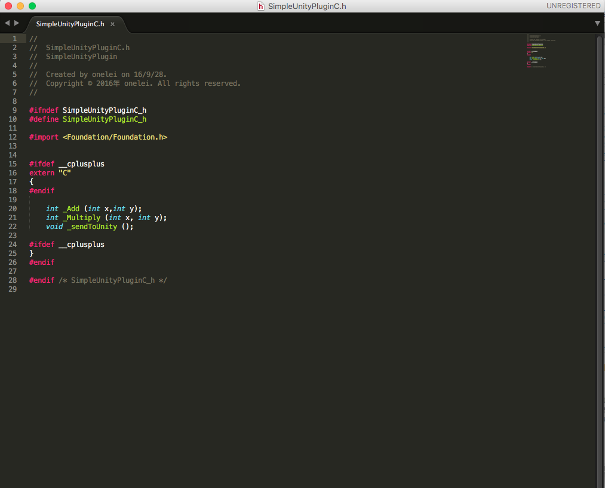

# IosPluginForUnity
 Using xcode creating ios plugin for Unity. 
 
## SoftWare

Unity version : 5.4.0p4

## Files
**"SimpleUnityPlugin.mm"**: For the ObjectC and C.

**"SimpleUnityPlugin.h"**: For the ObjectC.

**"SimpleUnityPluginC.h"**: For the C.

## How to use

Here are the simple sdk unity project .